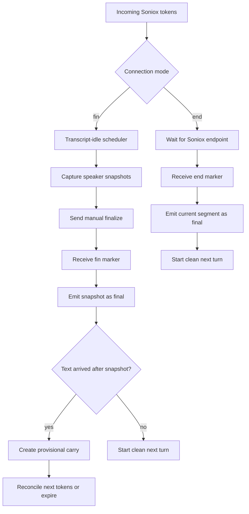

# Soniox `fin`-Only Carry Separation Plan

- Status: Implemented and locally verified
- Baseline branch: `codex/soniox-endpoint-devbox`
- Baseline commit: `15076953`
- Scope: `mingle-stt` Soniox real-time utterance segmentation
- Runtime behavior change: Implemented after technical review

## Implementation status (2026-08-16)

The reviewed design was implemented as one deployable change set:

- Requested and effective modes are resolved once, including `llm -> fin` fallback.
- Manual-finalize and provider-endpoint decisions are separate, so endpoint
  decisions cannot return carry.
- Speaker state is a discriminated `fin`/`end` union; only `fin` owns a
  `ManualFinalizeCarryController`.
- Token order is preserved around `<end>` and `<fin>`, including post-marker input.
- A stop-flush request remains active when `<end>` arrives before its `<fin>`
  completion barrier.
- Stop finalization also waits for audio already sent to Soniox when the first
  provider token has not arrived yet.
- Boundary action/cause logs and duplicate-stop suppression are explicit.
- Live STT tests now send the configured API namespace over WebSocket.

Validation included STT unit/build checks, the full app unit suite, an
`ios/v1.1.4` live stop suite, and a real Soniox `<end>` generated from a fixture
with trailing silence. Effective `end` produced zero carry lifecycle events and
no final transcript containing a boundary marker.

## Follow-up: Per-session endpoint conversation length (2026-08-22)

The endpoint-only carry separation remains unchanged, but the endpoint maximum
delay is now user-adjustable per STT session. The app stores
`demoEndpointMaxDelayMs` with a default of `2000`, exposes the existing
conversation-length slider for the modern namespaces, and sends
`soniox_endpoint_max_delay_ms` in the WebSocket start config. The server clamps
the value to `500..3000` and falls back to `2000` for older clients, so user
preferences do not require per-user server environment variables. The existing
manual-finalize setting remains separate and continues to default to `500` for
`fin`/`llm` behavior.

## 1. Executive summary

The target is to make the carry mechanism a strictly `fin`-only behavior.

- `fin` mode will keep the existing snapshot-based carry recovery because a race exists between sending a manual `finalize` request and receiving Soniox's `<fin>` response.
- `end` mode will trust Soniox semantic endpointing. A normal `<end>` boundary must finalize the current turn without creating provisional carry state, carry reconciliation, or a carry-expiry timer.
- Stop-recording and provider-close behavior must be redesigned explicitly for `end`; simply adding `if (strategy === 'fin')` around the current carry blocks can lose or duplicate the last words.
- The implementation should distinguish the requested strategy from the effective strategy. `llm` currently falls back to `fin`, so carry must remain enabled for that fallback until a real LLM strategy exists.

This is not a broad product feature, but it is a medium-to-high-risk STT state-machine change. The risk comes from finalization races, token watermarks, multiple speakers, and stop/close handoff rather than from the amount of code.

## 2. Provider contract used by this plan

The design relies on these Soniox guarantees:

- With endpoint detection enabled, Soniox finalizes all tokens in the segment and returns one final `<end>` token at the end of that finalized segment.
- With manual finalization, the client sends `{ "type": "finalize" }`; Soniox finalizes audio received up to that point and returns a final `<fin>` token when the request is complete.
- Final tokens are emitted once and do not change; non-final tokens may be revised or replaced.

References:

- [Soniox endpoint detection](https://soniox.com/docs/stt/rt/endpoint-detection)
- [Soniox manual finalization](https://soniox.com/docs/stt/rt/manual-finalization)
- [Soniox real-time transcription](https://soniox.com/docs/stt/rt/real-time-transcription)

The first guarantee is why endpoint mode should not need the current provisional carry workaround during normal streaming. We should still capture sanitized real payload fixtures before implementation to verify marker ordering and speaker metadata in our diarization configuration.

## 3. Terminology

### 3.1 `fin` mode

Mingle decides the utterance boundary using transcript inactivity. The server stores a snapshot, sends a manual Soniox `finalize` request, and waits for `<fin>`.

### 3.2 `end` mode

Soniox decides the utterance boundary using semantic endpointing. The server enables endpoint detection and finalizes the Mingle turn when `<end>` arrives.

### 3.3 Carry

Carry is not a normal partial transcript and is not simply “the next utterance.” It is a recovery mechanism for a manual-finalize race:

1. Mingle has snapshot `S` and sends `{ "type": "finalize" }`.
2. While Mingle waits for `<fin>`, the local accumulated view can advance from `S` to `S + T`.
3. When `<fin>` arrives, Mingle emits `S` as final.
4. Tail `T` is kept as provisional carry for the next turn.
5. Later provider tokens either confirm/replace `T`, or the carry-expiry timer finalizes `T` so it is not stranded.

The current carry implementation includes all of the following:

- Snapshot-length splitting.
- `latestNonFinalIsProvisionalCarry` state.
- Previous-language seeding through `getNextTurnDetectedLang`.
- Reconciliation against the next timestamped provider update.
- Promotion of a non-matching carry prefix into finalized text.
- A carry-expiry timer.
- `server_carry_expiry` finalization.
- Stop-recording flush of a remaining carry.

### 3.4 Post-end tokens

If tokens ever appear after `<end>` in the same provider response, they are ordered input for a new turn, not manual-finalize carry. They must be processed into a fresh endpoint turn without creating provisional carry state. This distinction should be represented in code and tests.

## 4. Current implementation

### 4.1 What is already correctly disabled in `end`

`SONIOX_SEGMENTATION_STRATEGY=end` currently does the following:

- Sets `usesSonioxEndpointDetection=true`.
- Sends `enable_endpoint_detection=true` with endpoint tuning parameters.
- Makes `refreshGlobalFinalizeScheduling()` clear the global silence timer and return.
- Emits normal endpoint finals with `finalize_source=soniox_endpoint`.

Therefore, the normal inactivity-driven manual-finalize scheduler is already disabled in endpoint mode.

### 4.2 Carry is still structurally enabled in `end`

The carry mechanism is not currently scoped to `fin`:

- Every speaker state has `latestNonFinalIsProvisionalCarry`.
- Every speaker state owns a `SilenceTimerStrategy`, even when the connection is in `end` mode.
- `scheduleCarryExpiry()` and `clearCarryExpiryTimer()` are available for every speaker.
- Both manual snapshot finalization and the common endpoint decision branch can restore `decision.carryText` without checking the effective mode.
- The incoming-frame reconciliation path checks provisional carry without checking the effective mode.
- A carry can be finalized as `server_carry_expiry` regardless of the requested strategy.

This means `end` currently disables the normal silence scheduler but does not establish the stronger invariant “carry cannot exist in endpoint mode.”

### 4.3 The strategy abstraction is only partially applied

`segmentation-strategy.ts` defines `SonioxEndpointStrategy`, `SilenceTimerStrategy`, and `createSegmentationStrategy()`, but `stt-server.ts` does not use the factory for speaker state. It always creates `SilenceTimerStrategy` and uses it mainly as a carry-expiry holder.

This creates three sources of truth:

1. Raw environment strategy ID.
2. `usesSonioxEndpointDetection` boolean.
3. A per-speaker object whose type is always `SilenceTimerStrategy`.

The implementation plan should collapse these into one resolved runtime mode.

### 4.4 Stop-recording still uses manual provider finalization

Even in `end` mode, stopping may send Soniox a manual `finalize` request to flush an incomplete last utterance. The current response path can use a snapshot boundary and create carry, then immediately flush it before acknowledging stop.

This path is the main reason a simple carry guard is unsafe. If carry creation is disabled without defining new stop semantics, text received around the stop boundary can be dropped, duplicated, or split inconsistently.

### 4.5 Marker cause and strategy are currently conflated

The final source is selected from `usesSonioxEndpointDetection`, not from the marker and request that actually caused the boundary. As a result, a `<fin>` produced by stop-time manual finalization in an `end` session may be logged as `soniox_endpoint`.

The refactor should track boundary cause separately from connection mode, even if the first implementation keeps the existing client-visible `finalize_source` values for compatibility.

### 4.6 Token ordering is discarded too early

The current parser detects marker tokens, skips them, and then aggregates text by speaker before evaluating the boundary. This is adequate only while we assume the marker is the last token in the finalized segment.

For a robust `end` implementation:

- Preserve marker position long enough to verify the official ordering contract.
- If a response violates the expected order, process tokens after `<end>` as a fresh normal endpoint turn.
- Do not route those tokens through provisional carry.

### 4.7 Existing test coverage is insufficient for the separation

Current tests cover endpoint configuration, clamping, language helpers, and finalize cohorts. They do not run the full state transitions for:

- Manual snapshot -> `<fin>` -> carry -> reconciliation.
- Carry expiry.
- Endpoint -> no carry.
- Endpoint stop-time `<fin>` behavior.
- Timeout and provider-close races.
- Multi-speaker endpoint/finalize interaction.

### 4.8 Current code map at the baseline commit

| File and area | Current responsibility | Separation concern |
|---|---|---|
| `mingle-stt/stt-server.ts:592` | Reads the requested strategy and derives `usesSonioxEndpointDetection` | Raw ID and effective behavior are not represented separately |
| `mingle-stt/stt-server.ts:858` | Disables global idle-finalize scheduling in `end` | This part is correct and should derive from the resolved runtime |
| `mingle-stt/stt-server.ts:980` | Finalizes requested speaker snapshots and creates post-snapshot carry | Must be reachable only for effective `fin` |
| `mingle-stt/stt-server.ts:1031` | Creates every speaker state with `SilenceTimerStrategy` | Endpoint speakers still own carry-capable state |
| `mingle-stt/stt-server.ts:1079` | Gracefully finalizes pending provider text during stop/close | Needs separate fin and end semantics |
| `mingle-stt/stt-server.ts:1307` | Reconciles provisional carry with incoming timestamped tokens | Must be fin-only |
| `mingle-stt/stt-server.ts:1370` | Evaluates both `<end>` and `<fin>` through one shared decision | Shared result can contain carry regardless of mode |
| `mingle-stt/stt-server.ts:1406` | Restores `decision.carryText` and schedules expiry | Has no effective-mode guard |
| `mingle-stt/segmentation-strategy.ts:112` | Shared marker decision and snapshot/marker split | Manual and provider boundaries should return different types |
| `mingle-stt/segmentation-strategy.ts:203` | Defines endpoint strategy configuration | Factory abstraction is not used for speaker lifecycle |
| `mingle-stt/segmentation-strategy.ts:256` | Mixes finalize-timer and carry-expiry responsibilities | Should be decomposed |
| `mingle-stt/soniox-language.ts:54` | Seeds a carry turn with the previous language | Must not be called for a fresh endpoint turn |
| `mingle-stt/runtime/shared/create-release-runtime.ts:14` | Defines client-visible finalization source values | Avoid expanding this contract in the first refactor unless required |

### 4.9 Relevant implementation history

Carry has accumulated several independent fixes, which explains why deleting it globally is risky:

- `ac89e88b`: introduced endpoint-tail splitting so text after a marker would not contaminate the previous final turn.
- `2786cfb2`: restored carry handling after the server moved to speaker-local turn state.
- `5da7bba4`: removed speaker-churn finalization paths that caused incorrect flush behavior.
- `2edb75e7` / PR `#172`: added exact stop/finalize handoff, snapshot carry flushing, timeouts, and finalization-source tracking.
- `b610ee41`: enabled semantic endpointing but deliberately reused most of the existing common finalization state machine.

The proposed work should preserve the battle-tested manual-finalize recovery in `fin` while removing only its ownership and reachability from effective `end`.

## 5. Current state flows



The intended end-mode path stops at `O`. It must not enter `I` or `J`.

## 6. Target behavior and invariants

### 6.1 Runtime resolution

Resolve requested and effective behavior once per Soniox connection:

| Requested strategy | Effective strategy | Endpoint detection | Manual idle finalize | Carry |
|---|---|---:|---:|---:|
| `fin` | `fin` | Off | On | On |
| `end` | `end` | On | Off | Off |
| `llm` today | `fin` fallback | Off | On | On |
| future implemented `llm` | Explicit future policy | Explicit | Explicit | Explicit |

Carry gating must use the effective strategy, not the raw environment value.

### 6.2 `fin` invariants

- Existing manual-finalize behavior remains unchanged.
- Carry can be created only from a known manual-finalize request with a captured snapshot.
- Carry belongs to the speaker snapshot that created it.
- Carry is emitted at most once as a partial and at most once as a final.
- Repeated provider tokens must not duplicate carry text.
- Carry expiry remains available only in this mode.
- Stop-recording continues to flush all pending snapshot/carry text exactly once.

### 6.3 `end` invariants

- No speaker can own provisional carry state.
- No carry-expiry timer can be scheduled.
- `getNextTurnDetectedLang(previousLanguage, carryText)` is never used to seed an endpoint turn.
- `server_carry_expiry` is unreachable.
- A normal `<end>` finalizes the provider segment exactly once.
- The following endpoint turn starts with clean text and `detectedLang=unknown`, then learns its language from its own tokens.
- Stop-time `<fin>` may flush an incomplete last turn, but it cannot create carry.
- Timeout/provider-close fallback emits the pending turn at most once.
- No token is discarded merely because carry is disabled.

### 6.4 Shared invariants

- `lastConsumedEndMs` remains monotonic per speaker.
- Final tokens are not emitted twice after retransmission.
- Marker text does not leak to the client transcript.
- Speaker labels and language detection remain scoped to the emitted turn.
- A mode is fixed for the lifetime of a Soniox connection. Environment changes apply to new connections only.

## 7. Design options

### Option A: Add mode guards to existing carry blocks

Example shape:

```ts
if (effectiveStrategy === 'fin' && decision.carryText) {
    // existing carry behavior
}
```

Advantages:

- Small diff.
- Fast to test superficially.

Problems:

- `end` speaker state still owns carry fields and a `SilenceTimerStrategy`.
- Stop-time text handling remains ambiguous.
- New call sites can accidentally re-enable carry.
- The shared decision type still advertises `carryText` for endpoint decisions.
- The code does not enforce the desired invariant.

Recommendation: do not use this as the final design. It is acceptable only as a temporary diagnostic experiment.

### Option B: Resolve an explicit runtime and separate mode-specific decisions and state

This is the recommended design.

```ts
type SonioxSegmentationRuntime =
    | {
          requested: 'fin' | 'llm';
          effective: 'fin';
          endpointDetection: false;
          carryPolicy: 'manual-finalize-snapshot';
      }
    | {
          requested: 'end';
          effective: 'end';
          endpointDetection: true;
          carryPolicy: 'none';
      };
```

Use separate decision types:

```ts
type ManualFinalizeDecision = {
    kind: 'manual-finalize';
    finalText: string;
    carryText: string;
    snapshotEndMs: number;
};

type EndpointDecision = {
    kind: 'provider-endpoint';
    finalText: string;
    finalEndMs: number;
};
```

`EndpointDecision` intentionally has no `carryText` property.

Use mode-specific speaker state:

```ts
type CommonSpeakerState = {
    speaker: string;
    providerFinalizedText: string;
    providerFinalizedEndMs: number;
    latestNonFinalText: string;
    currentSnapshotText: string;
    currentSnapshotEndMs: number;
    lastProgressAtMs: number;
    lastConsumedEndMs: number;
    detectedLang: string;
};

type FinSpeakerState = CommonSpeakerState & {
    mode: 'fin';
    carry: ManualFinalizeCarryController;
};

type EndSpeakerState = CommonSpeakerState & {
    mode: 'end';
};

type SonioxSpeakerState = FinSpeakerState | EndSpeakerState;
```

The endpoint state has no carry controller or carry timer. Type narrowing makes accidental use visible during review and compilation.

## 8. Recommended component boundaries

### 8.1 Runtime resolver

Add one pure resolver in `segmentation-strategy.ts` or a new `soniox-segmentation-runtime.ts`:

- Input: raw requested strategy and endpoint tuning values.
- Output: the discriminated `SonioxSegmentationRuntime`.
- Responsibility: `llm -> fin` fallback, endpoint config, carry capability, and startup log values.

Do not independently recompute `usesSonioxEndpointDetection`, manual-finalize scheduling, and carry support in `stt-server.ts`.

### 8.2 Manual-finalize decision helper

Keep snapshot-length splitting exclusively in a `fin` helper. It may return `carryText` and preserve the current CJK/word-boundary handling.

Suggested responsibility:

```ts
evaluateManualFinalizeResponse(requestSnapshot, currentState, marker)
```

This helper should require a manual request object. An unsolicited marker cannot create carry.

### 8.3 Provider-endpoint decision helper

Create an endpoint-only helper that:

- Accepts finalized segment tokens and `<end>`.
- Emits one endpoint decision.
- Never returns carry.
- Validates that `<end>` is final and at the end of the segment.
- Routes any anomalous post-marker tokens into a fresh normal turn and records a warning.

Suggested responsibility:

```ts
evaluateProviderEndpoint(segmentState, endpointToken)
```

### 8.4 Manual carry controller

Extract the carry-only fields and timers from `SilenceTimerStrategy` into a component owned only by `FinSpeakerState`:

- Provisional text.
- Snapshot-related language seed.
- Expiry timer.
- Reconciliation.
- Reset/dispose.

The existing per-speaker `SilenceTimerStrategy` currently mixes obsolete per-speaker finalize scheduling with carry expiry, while active manual finalization is scheduled globally. After extraction, remove the unused strategy/factory pieces if no call sites remain.

### 8.5 Connection-level finalize coordinator

Keep global manual-finalize request/cohort logic at the connection level because Soniox manual finalize is global. Make it available only when `runtime.effective === 'fin'`, except for a separate explicit graceful-stop operation.

The graceful-stop operation must carry a cause:

```ts
type FinalizeRequestCause = 'idle-fin' | 'stop-flush';
```

This prevents a stop `<fin>` in an `end` session from being mistaken for a normal semantic endpoint.

## 9. Desired path-by-path behavior

### 9.1 Normal `fin` finalization

1. Transcript becomes idle.
2. Capture per-speaker snapshots and timestamps.
3. Send manual finalize.
4. Receive final tokens and `<fin>`.
5. Finalize each requested snapshot.
6. Create carry only for text after each snapshot boundary.
7. Reconcile carry with later tokens or finalize it on expiry.

No intended behavioral change.

### 9.2 Normal `end` finalization

1. Accumulate Soniox tokens by speaker.
2. Receive final tokens followed by `<end>`.
3. Finalize the provider-defined segment.
4. Reset the turn state.
5. Process later tokens as a new normal endpoint turn.

No snapshot splitting, provisional carry, previous-turn language seed, or carry expiry is allowed.

### 9.3 Stop during `fin`

Preserve the current graceful behavior:

1. Stop sending audio.
2. Capture current snapshots.
3. Send manual finalize.
4. Split at the snapshots if needed.
5. Flush any resulting carry before the stop acknowledgement.
6. Close provider and client sockets according to the release runtime.

### 9.4 Stop during `end`

Recommended behavior:

1. Stop sending audio before creating the stop request.
2. If no text is pending, acknowledge immediately.
3. If text is pending, request one provider finalize to stabilize the incomplete last segment.
4. Append all final tokens returned before `<fin>` to each pending speaker's current incomplete turn.
5. Emit each pending turn once; preserve the existing stop-ack contract in which `final_turn` is the last emitted payload.
6. Do not snapshot-split and do not create carry.
7. On timeout or provider close, flush the latest local snapshot once.

Because audio has already stopped, any provider progress belongs to the same last incomplete turn. Treating it as carry would add complexity without representing a new user utterance.

### 9.5 `<end>` arrives while a stop request is active

Recommended precedence:

- `<end>` remains an authoritative semantic boundary and finalizes the current segment.
- The stop coordinator records the emitted payload as its final result.
- A later empty `<fin>` completes the stop request without another transcript emission.
- If more pending text exists after `<end>`, it is flushed once at stop; it is not carry.

### 9.6 Unsolicited `<fin>` in `end`

This should be treated as a provider/protocol anomaly:

- Log marker, mode, and whether a manual request was active.
- Finalize pending text once for safety.
- Do not create carry.
- Do not crash or close an otherwise healthy client connection solely because of the marker.

### 9.7 Multiple speakers

The first implementation should preserve the current speaker-cohort behavior and avoid combining this refactor with a diarization policy change.

Before implementation, capture whether `<end>` includes a useful speaker label in real `stt-rt-v5` payloads. If it does not, keep the current connection-level endpoint cohort behavior. Any change from global to speaker-specific endpoint finalization should be a separate reviewed decision.

## 10. Implementation plan

### Phase 0: Characterization and fixtures

- Capture sanitized raw Soniox result fixtures for:
  - Normal `<end>`.
  - Two speakers around one endpoint.
  - Stop before an endpoint, followed by `<fin>`.
  - `<end>` arriving while stop is in progress.
- Confirm marker ordering, `is_final`, timestamps, and speaker metadata.
- Add characterization tests for the current `fin` carry behavior before moving code.
- Record current final-source and carry-expiry counts from a local test session.

Exit criterion: reviewers can see provider-shaped fixtures for every boundary path.

### Phase 1: Introduce the resolved runtime

- Add `resolveSonioxSegmentationRuntime()`.
- Represent requested and effective modes separately.
- Move endpoint config and capability flags behind this runtime.
- Log both values at connection startup.
- Add unit tests for `fin`, `end`, and `llm -> fin` fallback.

Exit criterion: all behavior switches derive from one discriminated runtime.

### Phase 2: Split boundary decision types

- Replace the shared carry-capable `SegmentationDecision` for these paths with `ManualFinalizeDecision` and `EndpointDecision`.
- Move snapshot splitting under the manual-finalize helper.
- Make endpoint decisions incapable of returning carry.
- Preserve endpoint marker ordering until the endpoint decision has been made.
- Add pure reducer tests using the Phase 0 fixtures.

Exit criterion: endpoint code has no `carryText` property or snapshot-boundary dependency.

### Phase 3: Make carry state `fin`-only

- Introduce `FinSpeakerState` and `EndSpeakerState` or an equivalent compile-time separation.
- Extract `ManualFinalizeCarryController` from `SilenceTimerStrategy`.
- Move reconciliation, language seeding, prefix promotion, expiry, and disposal into the fin-only controller.
- Remove carry flags and timers from `EndSpeakerState`.
- Add an invariant test proving `server_carry_expiry` cannot occur in `end`.

Exit criterion: there is no runtime object in an endpoint speaker state that can schedule carry expiry.

### Phase 4: Separate stop and fallback lifecycles

- Add explicit `idle-fin` and `stop-flush` request causes.
- Preserve fin snapshot/carry behavior.
- Implement end stop-flush as one complete last turn with no snapshot carry.
- Define endpoint-vs-stop marker precedence.
- Verify timeout, send failure, provider close, and repeated stop handling.

Exit criterion: stop acknowledgements contain the correct final turn with no loss or duplicate emission in either mode.

### Phase 5: Cleanup and observability

- Remove unused `SilenceTimerStrategy` and strategy factory code if no call sites remain.
- Keep endpoint configuration helpers independent from turn-state lifecycle.
- Add structured boundary logs and invariant diagnostics.
- Update `mingle-stt/README.md` after behavior is implemented; README text must remain in English.

Exit criterion: no partial/obsolete abstraction remains that suggests carry is available in endpoint mode.

### Phase 6: Local and device verification

- Run unit/build checks through devbox.
- Run local STT integration with both modes.
- Run the connected iPhone against the device profile and Cloudflare tunnel.
- Keep endpoint sensitivity and latency adjustment at the current experiment
  values (`latency adjustment=0`, `sensitivity=0.7`). Compare the per-session
  maximum endpoint delay at `500`, `2000`, and `3000ms` during validation.
- Test normal conversation, alternating speakers, long pauses, rapid follow-up speech, and stopping mid-sentence.

Exit criterion: automated and live acceptance criteria below are satisfied.

## 11. Test matrix

### 11.1 Pure/unit tests

| Mode | Scenario | Expected result |
|---|---|---|
| `fin` | Snapshot `S`, then `<fin>` with no additional text | Final `S`; no carry |
| `fin` | Snapshot `S`, current text `S+T`, then `<fin>` | Final `S`; provisional carry `T` |
| `fin` | Next provider partial starts with `T` | Carry confirmed without duplication |
| `fin` | Next provider partial replaces `T` | Existing prefix promotion/reconciliation remains deterministic |
| `fin` | Carry receives no later token | `server_carry_expiry` emits `T` once |
| `fin` | Reset/dispose before expiry | Timer is cancelled; no late final |
| `end` | Final tokens followed by `<end>` | One `soniox_endpoint` final; no carry state |
| `end` | Pause without `<end>` | No final and no manual idle finalize |
| `end` | Repeated endpoint messages | Each segment emitted once |
| `end` | Tokens after `<end>` in one response | Tokens become a fresh turn; no provisional carry |
| `end` | Unsolicited `<fin>` | Safe single flush plus anomaly log; no carry |
| `llm` fallback | Manual finalize race | Same carry behavior as effective `fin` |

### 11.2 Stop/failure tests

| Mode | Scenario | Expected result |
|---|---|---|
| `fin` | Stop with pending snapshot and tail | Snapshot and tail delivered exactly once |
| `end` | Stop with incomplete utterance | Each pending speaker turn is stabilized once; no carry |
| `end` | `<end>` then stop `<fin>` | Endpoint final once; empty completion causes no duplicate |
| both | Provider finalize timeout | Latest pending text flushed once |
| both | Provider socket closes during request | Pending text flushed once and request resolved |
| both | Duplicate `stop_recording` | One acknowledgement/final lifecycle |
| both | Client disconnects first | Timers and state disposed without late writes |

### 11.3 Multi-speaker tests

- One idle speaker and one active speaker in `fin`.
- Endpoint while multiple speaker states contain pending text.
- Speaker label changes between provisional and final tokens.
- Carry remains attached to its originating speaker in `fin`.
- No previous-speaker language seed enters a new `end` turn.
- Timestamp watermarks prevent already-consumed tokens from being replayed.

### 11.4 Build and regression checks

- `mingle-stt` unit tests.
- `mingle-stt` TypeScript build.
- Existing release-runtime and behavior-profile tests.
- Web/client tests that consume `finalize_source` or stop acknowledgements.
- No mobile/API namespace bump unless the WebSocket contract changes.

## 12. Observability plan

Add concise structured logs around boundaries, not raw user audio or unrestricted transcripts:

```text
soniox_boundary requested=end effective=end marker=end cause=provider_endpoint carry=false
soniox_boundary requested=end effective=end marker=fin cause=stop_flush carry=false
soniox_carry_created requested=fin effective=fin speaker=2 chars=7
soniox_carry_resolved requested=fin resolution=provider_confirmed
soniox_carry_resolved requested=fin resolution=expiry_final
```

Recommended counters derived from logs:

- Final count by strategy and `finalize_source`.
- Carry created/resolved/expired count, which must be zero for effective `end`.
- Manual finalize request timeouts.
- Duplicate-final suppression count.
- Protocol anomalies such as `<fin>` without an active request or tokens after `<end>`.

During local verification, fail the test if an effective `end` session logs any `soniox_carry_*` event or `server_carry_expiry` final.

## 13. Rollout and rollback

### Rollout

1. Land characterization tests and runtime resolution without behavior change.
2. Land the mode separation and stop-path changes in the same deployable PR, using reviewable commits.
3. Verify `fin` locally against existing behavior.
4. Verify `end` locally with the connected iPhone and device tunnels.
5. Deploy STT server only if the WebSocket payload remains unchanged.
6. Observe final sources, timeout fallbacks, and zero end-mode carry events.

Intermediate commits that leave stop behavior inconsistent must not be deployed independently.

### Rollback

- Immediate operational rollback: set `SONIOX_SEGMENTATION_STRATEGY=fin` and restart STT.
- Code rollback: revert the separation PR if fin regression appears.
- No mobile rollback should be needed if the client contract is unchanged.

## 14. Risks and mitigations

### Risk: Dropped last words on stop

Cause: disabling carry before replacing end-mode stop semantics.

Mitigation: implement and test stop-flush before removing end carry paths; use provider-shaped fixtures and exact-once assertions.

### Risk: Duplicate final turns

Cause: `<end>`, `<fin>`, timeout fallback, and provider close can race.

Mitigation: one active boundary request with a cause, one completion function, and an emitted-turn/request ID guard.

### Risk: Incorrect speaker finalization

Cause: `<end>` speaker scope may differ from the current global handling.

Mitigation: preserve current behavior initially; capture real marker metadata; review speaker-scope changes separately.

### Risk: Language leakage across endpoint turns

Cause: carry currently seeds the next turn with the previous language.

Mitigation: endpoint turns reset language to `unknown` and learn from their own accepted tokens.

### Risk: `llm` fallback regression

Cause: gating carry on requested ID instead of effective behavior.

Mitigation: resolve and test `requested=llm`, `effective=fin`, `carry=enabled`.

### Risk: Hidden dead timers

Cause: keeping `SilenceTimerStrategy` on endpoint speaker state.

Mitigation: remove the object from `EndSpeakerState`; assert no active carry timers after reset/dispose.

### Risk: Provider contract anomaly

Cause: unexpected `<fin>`, multiple markers, or post-`<end>` tokens.

Mitigation: ordered token processing, safe fresh-turn handling, concise anomaly logs, and no data-dropping assertions.

## 15. Non-goals

- Retuning endpoint sensitivity or latency adjustment.
- Changing Soniox diarization policy.
- Changing unrelated conversation UI or audio settings.
- Replacing Soniox with another provider.
- Implementing the future `llm` segmentation strategy.
- Changing translation behavior.
- Changing mobile/API versions unless the client contract changes.

## 16. Reviewer checklist

Reviewers should explicitly answer the following:

1. Is carry correctly defined as a manual-finalize race recovery mechanism rather than a general next-turn buffer?
2. Does any effective `end` path still construct, reconcile, expire, or flush provisional carry?
3. Can `end` stop-time finalization lose text that arrives after the local snapshot but before `<fin>`?
4. Can `<end>`, stop `<fin>`, timeout, and provider close emit the same text more than once?
5. Is `llm -> fin` fallback resolved before capability checks?
6. Are speaker watermarks advanced at the correct boundary in both modes?
7. Does a new endpoint turn reset language instead of inheriting a carry seed?
8. Are timer cleanup and socket-close paths deterministic?
9. Does endpoint token processing preserve enough order to handle protocol anomalies safely?
10. Can the change be rolled back by switching to `fin` without reinstalling the app?

## 17. Open review decisions

The implementation should not begin until these decisions are confirmed:

1. **Endpoint speaker scope:** keep current all-pending-speaker handling, or use marker speaker metadata if verified?
   - Recommendation: preserve current behavior in this change.
2. **Stop final source:** add a distinct `soniox_stop_finalize`, or keep existing client-visible sources and add only an internal boundary cause?
   - Recommendation: add internal cause first to avoid expanding the client contract.
3. **Post-`<end>` anomaly behavior:** reject the frame or start a fresh turn?
   - Recommendation: start a fresh turn and log the anomaly so text is not lost.
4. **Refactor size:** nullable carry controller or discriminated speaker-state union?
   - Recommendation: discriminated union for compile-time enforcement.
5. **PR shape:** one large commit or several commits?
   - Recommendation: one deployable PR with separate characterization, runtime, carry separation, and lifecycle commits.

## 18. Definition of done

The work is complete only when all of the following are true:

- Effective `fin` preserves existing carry behavior and passes regression tests.
- Effective `end` cannot create carry state or schedule a carry-expiry timer.
- End-mode live logs contain no `server_carry_expiry` or carry lifecycle event.
- Normal `<end>`, stop-time `<fin>`, timeout, and provider close are exact-once.
- No tested scenario loses text across a boundary.
- Multi-speaker and language-reset behavior is verified.
- Unit tests and TypeScript build pass.
- Connected-iPhone device testing passes through devbox.
- Rollback to `fin` is verified without an app reinstall.
- The final implementation documentation is updated in English where it touches README files.
